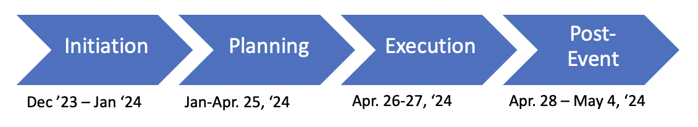

# Vision Statement

Create a responsive and interpretive environment for fellow students to explore cyber security concepts and ideas. Participants will solve Linux based puzzles regarding a multitude of major cyber security concepts (including but not limited to cryptography, steganography, web exploitation, cli commands, binary exploitation and much more) and then apply them in a scenario based challenge.

# Goals
Goals: The 5 goals for the 2024 Allen Cyber Games Invitational include:
* Allen High School Cyber Club students will have leveraged and improved their programming skills and developed other career-related skills (e.g. branding, recruiting, planning, etc.).
* The 2024 Allen Cyber Games Invitational will be executed relatively smoothly.
* The 2024 Allen Cyber Games will serve as the foundation for future Allen Cyber Games Invitationals.
* More than xx high school students, including at least xx students from other high schools, will participate in the 2024 Allen Cyber Games Invitational.
* The 2024 Allen Cyber Games Invitational will raise $xxxxxx to support student scholarships.

# Event Details
* When: Saturday, April 27, 2024 
* Where: Venue TBD (see Venue Requirements below)

# Roles
Skill Development and Mentors
As part of this effort, students will not only leverage (and improve) upon their programming skills. They will also work with a mentor to learn project management and event planning skills. To accomplish this, Allen Cyber Club members will be assigned to the roles identified in Table 1 below:

- Project Manager: James Dungan, JamesMDungan [Digital Portfolio](https://codermerlin.academy/users/james-dungan/Digital%20Portfolio/index.html)
  - Chair
  - Logistics Coordinator
- Release Manager: Blake Gateley, KrabbiePatty [Digital Portfolio](https://codermerlin.academy/users/jonathan-gateley/Digital%20Portfolio/index.html)
  - Operations Director
- Product Manager: Soohan Cho, BurntWaffleCake [Digital Portfolio](https://codermerlin.academy/users/soohan-cho/Digital%20Portfolio/index.html)
  - Director of Training Events
  - Director of Battle Rounds
- QA Analyst: Abel Semahegn, abelSemahegn [Digital Portfolio](https://codermerlin.academy/users/abel-semahegn/Digital%20Portfolio/index.html)
  - Comms and IT Director
- Engineer-Frontend: Aidan Morris, SirromEloc [Digital Portfolio](https://codermerlin.academy/users/aidan-morris/Digital%20Portfolio/index.html)
  - Volunteer Coordinator
  - Training Director
- Back-End Developer: Richard Jang, o7 [Digital Portfolio](https://codermerlin.academy/users/ming-ruei-jang/Digital%20Portfolio/index.html)
  - External Parties Coordinator
- UI/UX Designer: Onik Hoque, onikh [Digital Portfolio](https://codermerlin.academy/users/onik-hoque/Digital%20Portfolio/index.html)
  - Sponsor Coordinator
- DBA: Faraz Piracha, FarazPir [Digital Portfolio](https://codermerlin.academy/users/faraz-piracha/Digital%20Portfolio/index.html) 
  - Marketing Management
- Website Consultant: Marisa Patel, marisapatel5 [Digital Portfolio](https://codermerlin.academy/users/marisa-patel/Digital%20Portfolio/index.html) 

# Roles with Mentors
| Role                               | Responsibilities                                                                                   | Skills                                      | Assigned Student(s) | Assigned Mentor |
|------------------------------------|----------------------------------------------------------------------------------------------------|---------------------------------------------|---------------------|-----------------|
| Allen ISD Coordinator and Lead Mentor | Oversees all student planning and execution of the event.                                          | Superman                                    |                     | Mr. Ben         |
| Chair                              | Oversee planning committee                                                                         | Coordinating, Leading, Delegating, Conflict Management | James Dungan              | TBD             |
| Assistant (or Co-) Chair           | Supports the Chair, oversee development of a budget and tracks expenses                            | Coordinating, Financial management, Delegating, Conflict Management | Aidan Morris                   |                 |
| Volunteer Coordinator              | Identifies # of volunteers needed, establishes volunteer sign up opportunities, assigns volunteers, creates shifts, oversees volunteers day of event. Will need 1-2 deputies to support as Volunteer Coordinator on day of event so that Volunteer Coordinator can get breaks. | Recruiting, Organization, Conflict Management | Abel Semahegn               | TBD            |
| Operations Director (and Operations Team) | On day of event, this person (and her/his Operations team) will be the people who are keeping things moving, putting out fires, etc. | Action oriented, Problem solver, Calm under duress | Blake Gateley              | TBD             |
| Director of Training Events        | Develops, tests, and oversees execution of event day training events                               | Technical Prowess                            | Soohan CHo               | TBD             |
| Director of Battle Rounds          | Develops, tests, and oversees execution of event day battle rounds                                 | Technical Prowess                            | Soohan Cho               | TBD             |
| Logistics Coordinator              | Proactively identifies and obtains/provides logistics support before and during the event          | Planning, Organization, Logistics           | James Dungan            | TBD             |
| Comms and IT Director              | Responsible for establishing website to register, and arrange event communications system (e.g. radios) and event IT system | Technical Prowess                            | Abel Semahegn               | TBD             |
| Training Director                  | Responsible for train the trainers (i.e. ensure that those who will be training students are trained and ready); will also help lead a table-top exercise before the event. | Develops Others, Planner                    | Aidan Morris               | TBD             |
| Sponsor Coordinator                | Responsible for securing financial sponsors                                                        | Communication, Networking, Financial management | Onik Hoque               | Mrs. Jungman    |
| District/School Outreach Coordinator | Engages non-Allen ISD schools and/or districts                                                     | Communication, Networking with External Parties | Richard Jang               | TBD             |
| Clubs/Organizations Outreach Coordinator | Engages local clubs/organizations (e.g. Boy and Girl scout units) to invite participants           | Communication, Networking with External Parties | Richard Jang              | TBD             |
| Venue Coordinator                  | Serves as POC and coordinates with venue staff                                                     | Communication, Planning, Networking with External Parties |  James Dungan              | TBD             |
| Vendors Coordinator                | Coordinate vendors (e.g. food vendors, “merch”, etc.)                                              | Communication, Planning, Networking with External Parties | Marisa Patel               | TBD             |
| Special Guests Coordinator         | Invite and track attendance of special guests (e.g. Federal/state/local elected leaders, sponsor representatives, etc.) | Communication, Networking with External Parties | Blake Gateley               | TBD             |
| Branding Coordinator               | Develops Invitational logo and key messaging                                                       | Communication                               | Faraz Piracha              | TBD             |

# Student and Mentor Rules 
1. Mentors will complete an Allen ISD Background check.
1. Mentors and students will ALWAYS cc: Mr. Ben on all emails between one another.
1. Mentors and students will not contact one another via phone, texting, or virtual meetings without Mr. Ben or another member of Allen ISD staff participating in the conversation or meeting.
1. Mentors and students will not meet in-person without Mr. Ben or another member of Allen ISD staff present.
1. Mentors will never be in a classroom or event venue room with a student without Mr. Ben or another member of Allen ISD staff present. 
1. Students will coordinate with one another and make decisions (within Mr. Ben’s parameters). Mentors will advise individual students and recognize that the students need to effectively communicate with one another. If mentor identifies a risk/concern that (s)he does not believe students appropriately understand/appreciate, the mentor should communicate that directly to 1. Mr. Ben and the chair’s mentor so that, if appropriate, they can work with the chair to better understand the situation.

# Venue Requirements 
* Competition room (can accommodate xx students and their stations)
* Training room(s) (can accommodate xx students and their stations)
* Operations room (room that can easily accommodate an operations team of 6+ with work areas, dry erase board. Will need to add more space if running independent network for event as that should be run from Operations Center.)
* Volunteer break room
* Audio/video options
* Food service and eating area(s)
* Check-in area(s) for visitors and guests
* Multi-stall male and female restrooms
* Parking (can accommodate xxx personal vehicles and xxx buses)

# Equipment Needed
* Wifi network(s) for participants to be able to use during event (can be segregated from another network or a standalone network)
* Tables and chairs (competition room, training room(s), operations center, Volunteer sign in/out area)
* Laptops(?)

# Planning Timeline
Phases: There will be 4 phases to the 2024 Allen Cyber Games Invitational. Those phases and estimated timeframes are shown below:

